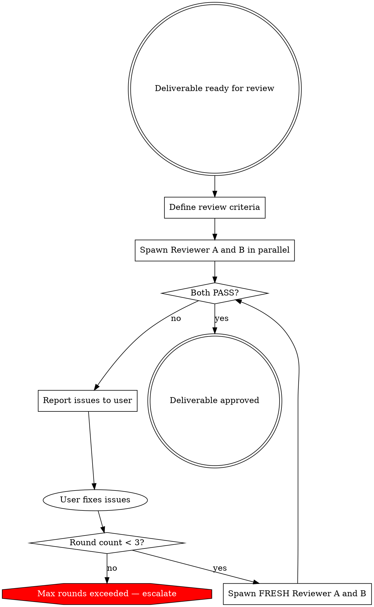

# Santa Review — Dual Independent Quality Gate

**One responsibility:** Validate a deliverable through two independent reviewers who must both approve before the deliverable proceeds.

This skill does NOT: fix issues (it reports them), implement changes, or approve on Lucas's behalf.

---

## Decision Flow



## Step 1: Define Review Criteria

Ask the user (or derive from context):
- **What** is being reviewed? (file path or inline content)
- **Criteria:** acceptance standards (spec compliance, quality bar, brand voice, technical accuracy)
- **Audience:** who will receive this deliverable (client, public, internal)

If criteria are unclear, ask before proceeding.

## Step 2: Spawn Two Independent Reviewers

<HARD-GATE>
Reviewers MUST be fresh agents with NO shared context. Neither reviewer sees the other's output. This prevents anchoring — if both independently find the same issue, it's real.
</HARD-GATE>

Dispatch 2 agents using the Agent tool with `model: "sonnet"`:

**Reviewer A prompt:**
```
You are an independent quality reviewer. Review the following deliverable against these criteria:

Deliverable: [path or content]
Criteria: [list]
Audience: [who receives this]

You have not seen any other review of this deliverable.

For EACH criterion, report:
- PASS or FAIL
- Specific evidence (quote the deliverable, cite line numbers)

Be rigorous — a PASS means you would stake your reputation on this.
End with: **Overall: PASS** or **Overall: FAIL** (list issues)

Report status per subagent-status-protocol: DONE (review complete), BLOCKED (cannot access deliverable), or NEEDS_CONTEXT (criteria unclear)
```

**Reviewer B prompt:** Identical structure, independently dispatched.

## Step 3: Evaluate Results

| Result | Interpretation | Action |
|--------|---------------|--------|
| Both PASS | High-confidence approval | Report approved to user |
| Both FAIL on same issue | High-confidence problem | Report with evidence from both |
| One PASS, one FAIL | Marginal issue | Report disagreement with both perspectives |
| Both FAIL on different issues | Multiple problems | Report all issues |

## Step 4: Re-review Loop (Max 3 Rounds)

If issues found:
1. Present all issues to user with specific evidence
2. User fixes the deliverable
3. Spawn TWO NEW fresh agents (never re-use previous reviewers)
4. Repeat evaluation

After 3 rounds without convergent PASS: escalate to user with full issue history across all rounds.

## When to Use This

- Client deliverables (proposals, decks, strategy documents)
- Content before publishing (Substack issues, LinkedIn long-form)
- Governance change proposals before presenting to Lucas
- Any output where "good enough" isn't good enough

## Red Flags — STOP and Reconsider

- "One reviewer is enough for this" → STOP. Single-point review misses what independent convergence catches.
- "Let me share Reviewer A's feedback with Reviewer B" → STOP. Isolation is the mechanism.
- "The deliverable is clearly fine, no need to review" → STOP. Confidence is not evidence.

**Enhanced Mode: Subjective + Objective Split (Paul Bakaus, paul-bakaus-004)**
For UI and code deliverables where pattern-matching analysis is possible, upgrade from two
identical LLM reviewers to a typed split:

- Reviewer A (LLM): holistic, subjective review. Opens source files and inspects rendered output
  in a fresh browser tab labeled '[LLM]'. Returns structured narrative findings.
- Reviewer B (CLI): deterministic pattern-matching. Runs a CLI/grep/AST detector against the
  deliverable for objective rule violations (e.g., banned patterns, accessibility rules, linting).
  Fresh browser tab labeled '[CLI]'.

Tab isolation rule: each reviewer MUST open its own new browser tab. Never reuse an existing tab
even if the URL matches — shared page state contaminates the assessment.

Standard Mode (identical LLM reviewers) remains correct for prose deliverables where no
deterministic detector exists.
